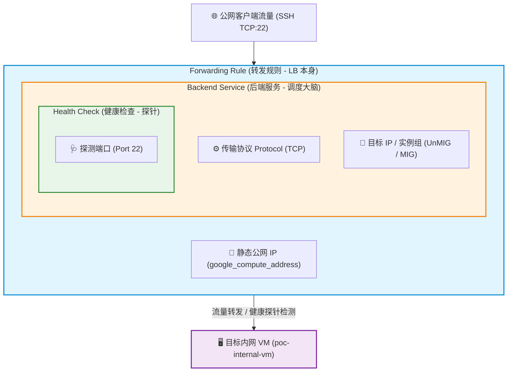

# GCP L4 外部网络负载均衡器深度解析：组件依赖模型、实战演练与 L4/L7 选型对比

在 GCP (Google Cloud Platform) 上构建云原生架构时，负载均衡器（Load Balancer）是连接外部流量与内部基础设施的核心枢纽。近期在一个 PoC 项目中，我们需要解决一个典型的安全演练需求：**如何在不给虚拟机分配公网 IP（Public IP）的前提下，通过公网入口实现对内网 VM 的 SSH (TCP 端口 22) 安全访问？**

本文将结合具体的 Terraform 代码演练，深入拆解 GCP L4 外部网络负载均衡器（External Network Load Balancer）的四大核心组件及其底层依赖链，厘清 L4 与 L7 负载均衡器的选型误区，并梳理日常运维排查必备的 `gcloud` CLI 工具集。

---

## 1. L4 与 L7 负载均衡器：关键差异与常见误区

在进行 GCP 负载均衡选型时，很多人容易混淆 4 层 (L4) 与 7 层 (L7) 的功能边界。以下是三个最常见的技术误区与解惑：

### 误区 1：L4 负载均衡器能否配置和卸载 SSL/TLS 证书？
**答：不能。**
* **原理**：L4 Network Load Balancer 工作在 OS 模型的传输层（TCP/UDP），采用纯粹的**包直通模式（Passthrough）**。它只根据源/目的 IP 和端口路由数据包，不对应用层 HTTP/HTTPS 报文做解密或标头拆包。
* **结论**：如果需要在负载均衡器层统一管理证书并进行 SSL 卸载（SSL Termination），必须选用 **L7 HTTP(S) Load Balancer** 或 **TCP Proxy Load Balancer**。若在 L4 下使用 SSL，证书必须在后端的 VM 或应用服务上自行解密。

### 误区 2：能否使用 L7 负载均衡器来转发 SSH (端口 22) 流量？
**答：不能。**
* **原理**：L7 Application Load Balancer 是应用级代理，专门理解 HTTP/HTTPS/HTTP2/gRPC 协议及其 Header、URL 路径。SSH 属于基于 TCP 的自定义应用层协议，L7 LB 无法对其进行解析与转发。
* **结论**：暴露 SSH、MySQL、Redis 等原生 TCP 流量，必须使用 **L4 Network Load Balancer** 或 **Proxy NLB**。

### 误区 3：GCP 实例组类型：MIG 与 UnMIG 有何区别？
在将 VM 挂载到负载均衡器后端时，需要通过实例组（Instance Group）呈现：
* **MIG (Managed Instance Group)**：基于实例模板（Instance Template）动态创建。支持自动弹性伸缩（Autoscaling）、自动修复（Autohealing）、多可用区分布与滚动更新。适合无状态微服务。
* **UnMIG (Unmanaged Instance Group)**：异构 VM 的手动集合。不支持扩缩容和自动修复，仅作为静态机器的逻辑容器。适合 PoC 验证、固定机器组合或不可弹性的传统服务。

### L4 NLB vs L7 ALB 核心对比表

| 特性维度 | L4 外部网络负载均衡器 (L4 NLB) | L7 外部应用负载均衡器 (L7 ALB) |
| :--- | :--- | :--- |
| **OSI 工作层级** | 传输层 (TCP/UDP) | 应用层 (HTTP/HTTPS/HTTP2/gRPC) |
| **流量转发模式** | Passthrough (包直通，保留客户端源 IP) | Proxy (代理模式，后向连接使用内部 IP) |
| **SSL 证书卸载** | 不支持（需后端自行解密） | 支持（托管证书 / 自动续期） |
| **高级路由** | 仅基于 IP/Port 散列 | 支持 Path 路由、Host 标头重写、Cookie 亲和性 |
| **SSH (端口 22) 转发** | **支持** | **不支持** |

---

## 2. GCP L4 NLB 的组件结构与底层代码依赖模型

在代码实现层面（如 Terraform HCL 声明），GCP L4 负载均衡器的各个组件并不是平铺展开的，而是遵循严密的**层层嵌套与包含依赖模型**：

* **Health Check (健康检查)**：最内层，显式包含具体的**探测端口 (Port)**（如 `port = 22`）。
* **Backend Service (后端服务)**：中间层，包含传输协议 **Protocol (TCP)**、目标 **Target IP / 实例组 (UnMIG/MIG)**，并指向 **Health Check**。
* **Forwarding Rule (转发规则)**：最外层入口，包含预留静态 **IP 地址**，并指向 **Backend Service**。

### 架构依赖图解 (Mermaid Diagram)



### 属性包含与依赖链明细

1. **Health Check (健康检查)**：
   - **包含核心属性**：探针端口 `tcp_health_check { port = "22" }`。

2. **Backend Service (后端服务)**：
   - **包含核心属性**：传输协议 `protocol = "TCP"`。
   - **包含/引用目标**：目标实例组/机器 `backend { group = google_compute_instance_group.poc_unmig.id }`。
   - **包含/引用探针**：引用 Health Check 实体 `health_checks = [google_compute_region_health_check.l4_lb_hc.id]`。

3. **Forwarding Rule (转发规则)**：
   - **包含/引用 IP**：预留公网静态 IP `ip_address = google_compute_address.l4_lb_ip.address`。
   - **包含/引用后端**：Backend Service 调度大脑 `backend_service = google_compute_region_backend_service.l4_lb_backend.id`。

### 💡 核心终极洞察：Forwarding Rule 就是 LB 本身

理解 GCP 负载均衡器时，需要分清**逻辑概念**与 **GCP 底层物理/代码组件实体** 的对齐关系：

* **逻辑概念层面 (Conceptual View)**：传统教科书或口头交流中，人们习惯把 Load Balancer 作为一个抽象虚概念，认为它由“前端 (Forwarding Rule) + 后端 (Backend Service)”共同构成。
* **GCP 实际组件与物理实体层面 (GCP Engine / API View)**：在 GCP 的底层网络（Andromeda SDN）与 API 资源定义中，**Forwarding Rule 实际上就是 Load Balancer 本身**！
  - 它在最外层绑定公网 IP、监听端口、做数据包捕获与 DNAT 转换。
  - 它在资源定义上直接包含了 `Backend Service` 作为自己的内部流量调度引擎。

> **结论**：逻辑上 LB 包含前端与后端；但从 GCP 实际代码与物理实体来看，Forwarding Rule 就是 LB 本身，它向上绑定公网 IP，向下包含 Backend Service 控制器。

---

## 3. Terraform 实战落地代码

以下为本次 PoC 的完整基础设施配置。

### 3.1 纯内网虚拟机配置 (`gcevm.tf`)
故意不配置 `access_config` 块，确保 VM 不分配公网 IP：

```hcl
resource "google_compute_instance" "poc_vm" {
  name         = var.instance_name
  machine_type = "n2d-standard-4"
  zone         = var.zone

  boot_disk {
    initialize_params {
      image = "debian-cloud/debian-11"
      size  = 60
      type  = "pd-standard"
    }
  }

  network_interface {
    network    = var.network_name
    subnetwork = var.subnet_name
    # 故意留空 access_config，不分配公网 IP
  }

  scheduling {
    preemptible         = true
    provisioning_model  = "SPOT"
    automatic_restart   = false
    on_host_maintenance = "TERMINATE"
  }

  tags = ["poc-internal-vm"]
}
```

### 3.2 非托管实例组配置 (`unmig.tf`)

```hcl
resource "google_compute_instance_group" "poc_unmig" {
  name        = "poc-unmanaged-instance-group"
  description = "Unmanaged Instance Group for Cloud LB PoC"
  zone        = var.zone
  network     = google_compute_instance.poc_vm.network_interface[0].network

  instances = [
    google_compute_instance.poc_vm.id
  ]
}
```

### 3.3 L4 负载均衡器与防火墙配置 (`l4-lb.tf`)

```hcl
# 1. 预留区域级公网静态 IP
resource "google_compute_address" "l4_lb_ip" {
  name   = "poc-l4-lb-ip"
  region = var.region
}

# 2. TCP 健康检查 (针对 22 端口)
resource "google_compute_region_health_check" "l4_lb_hc" {
  name   = "poc-l4-lb-health-check"
  region = var.region

  tcp_health_check {
    port = "22"
  }
}

# 3. 区域级 Backend Service
resource "google_compute_region_backend_service" "l4_lb_backend" {
  name                  = "poc-l4-lb-backend-service"
  region                = var.region
  protocol              = "TCP"
  load_balancing_scheme = "EXTERNAL"
  health_checks         = [google_compute_region_health_check.l4_lb_hc.id]

  backend {
    group = google_compute_instance_group.poc_unmig.id
  }
}

# 4. 区域级 Forwarding Rule
resource "google_compute_forwarding_rule" "l4_lb_forwarding_rule" {
  name                  = "poc-l4-lb-forwarding-rule"
  region                = var.region
  ip_address            = google_compute_address.l4_lb_ip.address
  ip_protocol           = "TCP"
  port_range            = "22"
  load_balancing_scheme = "EXTERNAL"
  backend_service       = google_compute_region_backend_service.l4_lb_backend.id
}

# 5. 防火墙规则：必须放行 GCP 官方 Health Check 网段
resource "google_compute_firewall" "allow_ssh_lb" {
  name    = "poc-allow-ssh-via-lb"
  network = var.network_name

  allow {
    protocol = "tcp"
    ports    = ["22"]
  }

  # 注意：必须包含 GCP Health Checker 的标准 CIDR
  source_ranges = [
    "0.0.0.0/0",
    "35.191.0.0/16",
    "130.211.0.0/22"
  ]

  target_tags = ["poc-internal-vm"]
}
```

> **⚠️ 防火墙坑点提醒**：
> GCP 的负载均衡器探针是从固定的 GCP 系统网段（`35.191.0.0/16` 与 `130.211.0.0/22`）发出的。如果在防火墙中配置了 `0.0.0.0/0` 允许公网流量，但遗漏了健康检查网段，或者由于优先级更高的 deny 规则阻断了这两个网段，Backend Service 就会显示后端 `UNHEALTHY`，导致所有公网请求被拒绝。

---

## 4. 运维诊断与命令行工具箱 (`gcloud` CLI)

在排查负载均衡器问题时，`gcloud` 命令是比 Console 界面更高效的工具。我们可以分别按三大组件进行列出与属性深挖：

### 4.1 Forwarding Rule 排查
```bash
# 列出区域/全局转发规则
gcloud compute forwarding-rules list

# 查看指定 Forwarding Rule 详细绑定参数
gcloud compute forwarding-rules describe poc-l4-lb-forwarding-rule --region=europe-west2
```

### 4.2 Health Check 排查
```bash
# 列出所有健康检查
gcloud compute health-checks list

# 查看健康检查阈值与端口细节
gcloud compute health-checks describe poc-l4-lb-health-check --region=europe-west2
```

### 4.3 Backend Service 与健康状态排查
```bash
# 列出后端服务
gcloud compute backend-services list

# 查看 Backend Service 配置
gcloud compute backend-services describe poc-l4-lb-backend-service --region=europe-west2

# 🌟 核心排查命令：查看后端实例的实时健康探针状态
gcloud compute backend-services get-health poc-l4-lb-backend-service --region=europe-west2
```

获取到的状态格式如下：
```yaml
backend: https://www.googleapis.com/.../instanceGroups/poc-unmanaged-instance-group
status:
  healthStatus:
  - forwardingRule: https://www.googleapis.com/.../forwardingRules/poc-l4-lb-forwarding-rule
    forwardingRuleIp: 34.39.47.144
    healthState: HEALTHY
    instance: https://www.googleapis.com/.../instances/poc-internal-vm
    ipAddress: 192.168.0.239
    port: 80
```

---

## 5. 连通性测试与验证

当 Backend Service 的状态变为 `HEALTHY` 后，我们使用端口扫描与 SSH 密钥握手进行验证：

### 端口探测
```bash
$ nc -zv -w 5 34.39.47.144 22
Connection to 34.39.47.144 22 port [tcp/ssh] succeeded!
```

### SSH Banner 抓取
```bash
$ ssh-keyscan -t rsa,ed25519 34.39.47.144
# 34.39.47.144:22 SSH-2.0-OpenSSH_8.4p1 Debian-5+deb11u7
34.39.47.144 ssh-ed25519 AAAAC3NzaC1lZDI1NTE5AAAAIO9+stN7FpUq5hcTI9ODrOtkPjfolmxbpIb9ZolWsH6T
```

返回的 `OpenSSH_8.4p1 Debian-5` 证明流量已成功跨越静态 LB 入口，无损穿透至纯内网 VM，测试成功完成。
