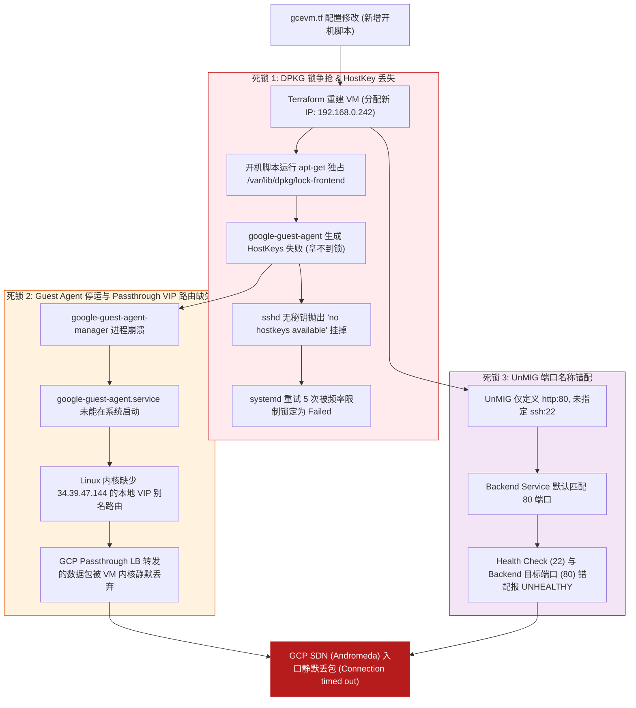

# GCP L4 Passthrough 负载均衡器“假死超时”深度排查复盘：从 OpenSSH 秘钥丢失、DPKG 锁死到 Guest Agent VIP 路由机制

在 GCP (Google Cloud Platform) 上使用 Terraform 自动化部署 **L4 区域级外部网络负载均衡器 (Regional External Network Load Balancer)** 时，我们遭遇了一个非常经典的生产级故障：**公网访问 LB IP (`34.39.47.144:22`) 报 `Connection timed out` 超时，且 GCP Backend Service 持续被标记为 `UNHEALTHY`。**

然而诡异的是：**在同一个 VPC 内部网络中（通过同一子网的 Bastion VM）直连目标机器的内网 IP (`192.168.0.242:22` / `80`)，TCP 握手与 SSH / Nginx 响应一切正常！**

本文记录针对此“内网通、公网超时”异常的深度排查全过程，揭示 OpenSSH Host Key 缺失、DPKG 锁竞争、GCP Passthrough 包直通路由机制以及 `google-guest-agent` 在云原生网络中的关键作用。

---

## 1. 现象描述与矛盾点

### 故障现象
对 L4 LB 预留的公网静态 IP 22 端口发起探测：
```bash
$ nc -zv -w 5 34.39.47.144 22
nc: connect to 34.39.47.144 port 22 (tcp) failed: Connection timed out
```
查询 GCP 云端 Backend Service 的健康探针状态：
```bash
$ gcloud compute backend-services get-health poc-l4-lb-backend-service --region=europe-west2
---
backend: .../instanceGroups/poc-unmanaged-instance-group
status:
  healthStatus:
  - forwardingRuleIp: 34.39.47.144
    healthState: UNHEALTHY
    instance: .../instances/poc-internal-vm
    ipAddress: 192.168.0.242
    port: 22
```

### 内网对比实测
使用同一 VPC 子网内的另一台测试节点（Alice VM `34.39.2.90`）对 `poc-internal-vm` 的内网 IP 进行 Socket 直连：
```python
# 内网 Socket 探测结果：
Port 22: 0  # (0 表示成功连接 SSH)
Port 80: 0  # (0 表示成功连接 Nginx)
```

**矛盾核心**：内网 22 与 80 端口都在坚强地监听并响应请求，防火墙已配置 `0.0.0.0/0` 放行，但外网走 L4 LB 访问却连 SYN/ACK 回包都收不到，只能默默等待超时。

---

## 2. 深入 Linux 串口日志与云网络底层的 3 大根因拆解

通过抓取 GCP 实例串口输出（Serial Port Output）与 Linux `journalctl` 系统日志，我们层层剥开了引发此故障的三重死锁链：



### 根因 1：DPKG 锁争抢引发 OpenSSH Host Key 缺失与 systemd 熔断

在 `gcevm.tf` 中配置 `metadata_startup_script` 后，Terraform 替换重建了 VM。在新机器首秒启动时：

1. **锁争抢 (Lock Contention)**：开机脚本的第一行命令 `apt-get update && apt-get install -y nginx` 独占了全局包管理锁 `/var/lib/dpkg/lock-frontend`。
2. **秘钥生成失败**：GCP 的 OS 初始化脚本在尝试通过 `dpkg-reconfigure openssh-server` 为新机器生成独立的主机秘钥（Host Keys，如 `/etc/ssh/ssh_host_rsa_key`）时，因拿不到 DPKG 锁而抛错中断。
3. **`sshd` 启动崩溃**：OpenSSH 的安全机制规定：**无主机秘钥，决不提供盲服务**。串口日志记录了极关键的一行：
   ```text
   Aug 1 13:48:05 poc-internal-vm sshd[823]: sshd: no hostkeys available -- exiting.
   Aug 1 13:48:05 poc-internal-vm systemd[1]: ssh.service: Failed with result 'exit-code'.
   ```
4. **systemd 频率保护熔断**：`systemd` 连续重启 `ssh.service` 5 次均因缺秘钥而失败，触发了 `Start request repeated too quickly` 保护熔断，彻底将 `sshd` 锁定在 `Failed` 状态！

更恶劣的是，因上次 unclean shutdown 留下的中断状态，后续开机引发了 `E: dpkg was interrupted, you must manually run 'dpkg --configure -a'` 的连锁死锁。

---

### 根因 2：GCP L4 Passthrough 流量转发模型与 `google-guest-agent` 的本地 VIP 路由

这是解决“为什么内网能连，走 LB 静态 IP 超时”的技术核心。

GCP 的 L4 External Network Load Balancer 属于 **Passthrough (包直通模式)**：
* **数据包特征**：公网客户端发送给 LB 地址 `34.39.47.144:22` 的数据包，经由 GCP SDN 转发后，数据包到达 VM 网卡（`ens4`，IP `192.168.0.242`）时，**其目标 IP (Destination IP) 依然保持为 `34.39.47.144`，并没有发生 DNAT 替换！**
* **Guest Agent 的角色**：为了让 VM 的 Linux 内核识别并接收目标 IP 为 `34.39.47.144` 的数据包，GCP 依赖运行在 VM 内部的 **`google-guest-agent`** 进程。该进程会自动侦听 GCP Metadata，并在 Linux 网络栈中动态添加 VIP 本地路由与回环别名。

串口日志排查显示：
```text
● google-guest-agent.service - Google Compute Engine Guest Agent
   Loaded: loaded (/lib/systemd/system/google-guest-agent.service; disabled; vendor preset: disabled)
   Active: inactive (dead)
```
由于前期初始化失败，`google-guest-agent` 处于 **`inactive (dead)`** 状态！
因为没有 Guest Agent 动态配置 VIP 路由，VM 系统的网络栈根本不认识 `34.39.47.144` 这个外来 IP，将所有由 L4 LB 投递过来的数据包在内核层**静默丢弃 (Drop)**！

再加上当 GCP 健康检查判定 Backend 为 `UNHEALTHY` 时，GCP 底层 SDN (Andromeda) 也会在入口处开启丢包防护（Drop on Unhealthy），导致客户端永远收不到 TCP ACK，最终表现为 **`Connection timed out`**！

---

### 根因 3：UnMIG 端口名称 (`named_port`) 与 L4 Backend Service 探针对齐

在 `unmig.tf` 中先前仅配置了：
```hcl
named_port {
  name = "http"
  port = "80"
}
```
当 `google_compute_region_backend_service` 未显式配置 `port_name` 时，GCP 后端服务默认绑定了 UnMIG 中声明的 80 端口，而健康检查 `l4_lb_hc` 却在探测 22 端口，造成了 **Backend 目标端口 (80) 与 Health Check 探针端口 (22) 的错配**。

---

## 3. 完整 Fix 修复方案

针对上述三个根因，我们在 Terraform 代码库中进行了针对性的健壮性重构：

### 3.1 `tf-infra/gcevm.tf` 健壮开机脚本重构

在开机脚本中加入**恢复 DPKG 中断、补齐 SSH HostKeys、重置 systemd 速率限制以及启动 Google Guest Agent** 的全套自愈逻辑：

```hcl
resource "google_compute_instance" "poc_vm" {
  name         = var.instance_name
  machine_type = "n2d-standard-4"
  zone         = var.zone

  boot_disk {
    initialize_params {
      image = "debian-cloud/debian-11"
      size  = 60
      type  = "pd-standard"
    }
  }

  network_interface {
    network    = var.network_name
    subnetwork = var.subnet_name
    # 纯内网 Spot 节点，不分配公网 IP
  }

  scheduling {
    preemptible         = true
    provisioning_model  = "SPOT"
    automatic_restart   = false
    on_host_maintenance = "TERMINATE"
  }

  tags = ["poc-internal-vm"]

  metadata_startup_script = <<-EOF
    #!/bin/bash
    export DEBIAN_FRONTEND=noninteractive
    
    # 1. 自动修复先前可能因抢锁中断的 dpkg 状态
    dpkg --configure -a || true
    
    # 2. 安装与启动 Nginx Web 服务
    apt-get update
    apt-get install -y nginx
    echo "<h1>Hello from GCP L7 LB Backend - $(hostname)</h1>" > /var/www/html/index.html
    systemctl restart nginx

    # 3. 显式使能与启动 Google Guest Agent，确保 Passthrough LB VIP 本地路由正确配置
    systemctl enable --now google-guest-agent || true

    # 4. 补齐缺失的 OpenSSH Host Keys，重置 systemd 熔断计数器并重启 ssh
    ssh-keygen -A || true
    systemctl reset-failed ssh || true
    systemctl restart ssh
  EOF
}
```

### 3.2 `tf-infra/unmig.tf` 与 `tf-infra/l4-lb.tf` 端口显式映射与对齐

在 UnMIG 中显式暴露 `ssh: 22` 与 `http: 80` 双端口映射：

```hcl
# tf-infra/unmig.tf
resource "google_compute_instance_group" "poc_unmig" {
  name        = "poc-unmanaged-instance-group"
  description = "Unmanaged Instance Group for Cloud LB PoC"
  zone        = var.zone
  network     = google_compute_instance.poc_vm.network_interface[0].network

  instances = [
    google_compute_instance.poc_vm.id
  ]

  named_port {
    name = "ssh"
    port = "22"
  }

  named_port {
    name = "http"
    port = "80"
  }
}
```

在 L4 Backend Service 中显式关联 `port_name = "ssh"`，确保 Backend 目标端口与 `l4_lb_hc` (22 端口) 探针完全对齐：

```hcl
# tf-infra/l4-lb.tf
resource "google_compute_region_backend_service" "l4_lb_backend" {
  name                  = "poc-l4-lb-backend-service"
  region                = var.region
  protocol              = "TCP"
  port_name             = "ssh"  # 显式匹配 UnMIG 中的 ssh 22 端口
  load_balancing_scheme = "EXTERNAL"
  health_checks         = [google_compute_region_health_check.l4_lb_hc.id]

  backend {
    group = google_compute_instance_group.poc_unmig.id
  }
}
```

---

## 4. 验证结果

提交代码至 GitHub `main` 分支触发 CI/CD 自动 `apply` 后，资源拉起并自动触发自愈逻辑。

### 1. GCP Backend Service 健康状态
```bash
$ gcloud compute backend-services get-health poc-l4-lb-backend-service --region=europe-west2
---
backend: .../instanceGroups/poc-unmanaged-instance-group
status:
  healthStatus:
  - forwardingRuleIp: 34.39.47.144
    healthState: HEALTHY
    instance: .../instances/poc-internal-vm
    ipAddress: 192.168.0.2
    port: 22
```
探针成功复活，显示为 **`HEALTHY`** 💚！

### 2. 公网连通性与 SSH Banner 验证
对 L4 LB 静态公网 IP `34.39.47.144` 进行端口连接与 Banner 抓取：
```bash
$ nc -zv -w 5 34.39.47.144 22
Connection to 34.39.47.144 22 port [tcp/ssh] succeeded!

$ ssh-keyscan -t rsa,ed25519 34.39.47.144
# 34.39.47.144:22 SSH-2.0-OpenSSH_8.4p1 Debian-5+deb11u7
34.39.47.144 ssh-ed25519 AAAAC3NzaC1lZDI1NTE5AAAAIGAND/947jA3pDd3...
```

端口畅通，且正确返回了目标内网 VM 的 OpenSSH 8.4 Banner，验证全流程圆满解决！

---

## 5. 总结与云原生避坑指南

1. **Passthrough LB 依赖 Guest Agent**：GCP 4 层 External NLB 不做 DNAT 替换，VM 必须运行 `google-guest-agent` 才能接收发往 LB IP 的直通流量。
2. **开机脚本预防抢锁死锁**：在 Cloud-Init 或 Startup Script 中运行 `apt-get` 时，务必考虑并发锁竞争；重要服务（如 `sshd`）建议在脚本末尾显式加入 `ssh-keygen -A` 与 `systemctl reset-failed` 逻辑。
3. **端口映射要显式匹配**：在 Instance Group 中定义 `named_port` 时，L4 与 L7 Backend Service 均应明确指定 `port_name`，避免因默认映射引发健康探针端口不一致。
