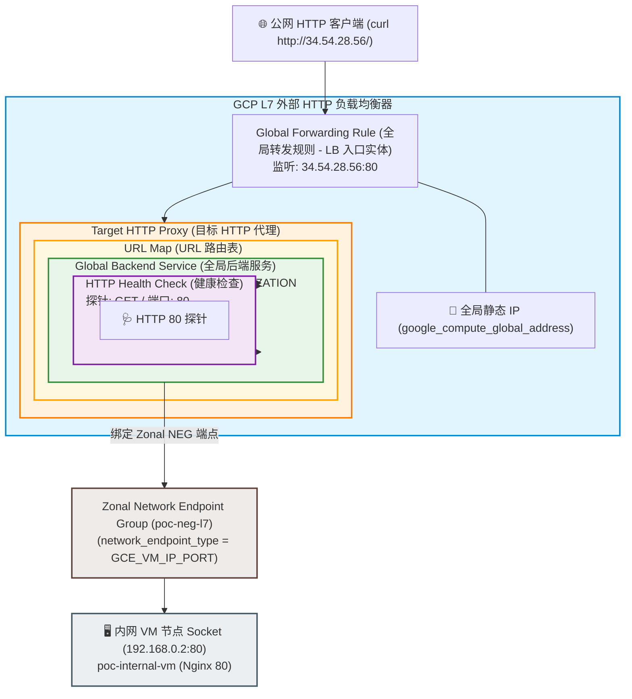

# GCP L7 外部 HTTP 负载均衡器深度解析：架构组件、Zonal NEG 解耦与 L4/L7 选型避坑指南

在 GCP (Google Cloud Platform) 云原生架构演进中，**L7 外部应用负载均衡器 (External Application Load Balancer / HTTP ALB)** 是实现 HTTP/HTTPS 协议拆包、7 层 URL 路径路由以及全球 Anycast 加速的核心入口。

但在将负载均衡器与后端计算资源（Compute Engine VM）进行对接时，很多工程师常被云厂商的抽象概念混淆（如“L7 代理的是 VM 还是服务？”），并在多负载均衡器复用同一 VM 时遭遇物理级架构冲突（如 `instance may belong to at most one load-balanced instance group`）。

本文结合 Terraform 代码实战演练，深入拆解 GCP L7 ALB 的 6 大核心组件与其物理依赖关系，厘清 L7 服务代理的本质，剖析基于 **Zonal NEG (网络端点组)** 解耦单 VM 挂载多 LB 限制的解决方案，并给出日常运维诊断命令集。

---

## 1. 概念澄清：L7 LB 代理的本质到底是什么？

在云基础设施配置中，存在一个经典的认知误区：**“L7 负载均衡器代理的是整台虚拟机 (VM) 操作系统。”**

这种说法在物理和协议层面是不严格的。从网络工程与应用层协议来看：

1. **代理本质**：L7 LB（底层由 GCP Envoy 反向代理集群承载）代理的是**运行在 VM 操作系统上特定 Socket (`IP : Port`) 的具体 HTTP/HTTPS 服务进程**（如 Nginx 80、SpringBoot 8080）。
2. **端口映射机制**：
   - 如果使用非托管实例组 (UnMIG)，必须通过 `named_port { name = "http", port = 80 }` 将符号名称与真实端口显式绑定，L7 Backend Service 通过 `port_name = "http"` 寻址。
   - 如果使用 Zonal NEG (`GCE_VM_IP_PORT`)，则直接将 `VM_IP : Port` 作为网络端点绑定。
3. **反向代理 vs 直通模式**：
   - **L4 NLB (Passthrough 直通)**：代理的是网络通道（TCP/UDP）。数据包到达 VM 网卡时，目标 IP 保持为 LB 的 VIP。VM 只要打开对应 TCP 端口即可，不关心具体协议。
   - **L7 ALB (Reverse Proxy 反向代理)**：L7 LB 在边缘节点终止客户端的 TCP/TLS 连接，拆解 HTTP 标头；然后 **L7 LB 自身作为客户端**，在 GCP 内部向后端的 `VM_IP : Port` 发起全新的内部 HTTP 请求。因此后端 Socket 必须能听懂并正确响应 HTTP 规范（如返回 200 OK）。

---

## 2. GCP L7 ALB 架构构成与 6 大组件依赖模型

不同于 4 层 LB 的 4 组件模型，GCP 全局 L7 HTTP 负载均衡器由 **6 个逻辑/代码实体组件** 组成，形成了自外向内的层层嵌套与引用链：



### 属性包含与依赖链明细 (Dependency Chain)

1. **HTTP Health Check（健康检查）**：
   - 探针不仅检查 TCP 连通，还检查 HTTP 响应。配置 `http_health_check { port = 80, request_path = "/" }`。
2. **Global Backend Service（全局后端服务）**：
   - 流量分发与负载策略大脑。指定 `protocol = "HTTP"`、`port_name = "http"`、引用 Health Check ID，并绑定后端组 (Zonal NEG / Instance Group)。
3. **URL Map（URL 路由映射表）**：
   - 7 层路由大脑。定义 Host / Path 匹配规则，默认路由指向指定的 `backend_service`。
4. **Target HTTP Proxy（目标 HTTP 代理）**：
   - 关联 `url_map`，负责将从 Forwarding Rule 接收的流量进行 HTTP 解包，并交由 URL Map 路由。
5. **Global Address（全局静态 IP）**：
   - 预留全局 Anycast IPv4 地址（如 `34.54.28.56`）。
6. **Global Forwarding Rule（全局转发规则）**：
   - **LB 外网入口实体**。绑定静态 IP，监听公网 80 端口，并将流量注入到 `target_http_proxy`。

---

## 3. 单 VM 挂载多 LB 避坑指南：Zonal NEG 架构解耦

在实际演练中，当尝试将同一台 VM (`poc-internal-vm`) 同时挂载给之前的 **L4 Passthrough NLB** 和全新的 **L7 HTTP ALB** 时，遭遇了 GCP API 的物理级冲突报错：

### 遇到的报错与根因

* **报错一（负载均衡模式冲突）**：
  ```text
  Validation failed for instance group 'poc-unmanaged-instance-group': 
  backend services 'poc-l7-lb-backend-service' and 'poc-l4-lb-backend-service' point to the same instance group but the backends have incompatible balancing_mode.
  ```
  - **根因**：L4 Passthrough NLB 的 Backend Service 要求 `balancing_mode = "CONNECTION"`，而 L7 ALB 要求 `balancing_mode = "UTILIZATION"` 或 `"RATE"`。GCP 禁止同一个 Instance Group 在不同 Backend Service 中使用不兼容的 `balancing_mode`。
* **报错二（实例组挂载上限约束）**：
  ```text
  Validation failed for instance 'poc-internal-vm': 
  instance may belong to at most one load-balanced instance group.
  ```
  - **根因**：GCP 限制**一台 GCE 虚拟机最多只能属于一个被 Load Balancer 挂载的实例组 (Instance Group)**。为了解决模式冲突而创建第二个 UnMIG 包含同一 VM，会被 GCP API 拒绝。

### 终极解法：使用 Zonal Network Endpoint Group (Zonal NEG)

针对此限制，云原生架构的官方标准解法是引入 **Zonal NEG (`GCE_VM_IP_PORT`)**：

* L4 Passthrough NLB 继续使用 **Instance Group (`poc_unmig`)** 绑定 SSH 22 端口。
* L7 HTTP ALB 改用 **Zonal NEG (`poc_neg_l7`)** 绑定 VM 内网 `IP : 80` 端口。

Zonal NEG 将应用层端点解耦，完全绕过了“单一实例组”和“ balancing_mode 冲突”的物理约束！

---

## 4. Terraform 实战落地代码

以下为通过 Zonal NEG 搭建 L7 ALB 的完整 Terraform 配置文件 (`l7-lb.tf`)。

```hcl
# 0. 创建 Zonal Network Endpoint Group (NEG)，绕过多 LB 挂载同一 VM 的实例组限制
resource "google_compute_network_endpoint_group" "poc_neg_l7" {
  name                  = "poc-neg-l7"
  network               = var.network_name
  subnetwork            = var.subnet_name
  default_port          = "80"
  zone                  = var.zone
  network_endpoint_type = "GCE_VM_IP_PORT"
}

# 绑定内网 VM IP 与 80 端口到 NEG
resource "google_compute_network_endpoint" "poc_neg_endpoint" {
  network_endpoint_group = google_compute_network_endpoint_group.poc_neg_l7.name
  instance               = google_compute_instance.poc_vm.name
  port                   = 80
  ip_address             = google_compute_instance.poc_vm.network_interface[0].network_ip
  zone                   = var.zone
}

# 1. 预留全局静态公网 IP (7层 HTTP LB 专享 Anycast IP)
resource "google_compute_global_address" "l7_lb_ip" {
  name = "poc-l7-lb-ip"
}

# 2. HTTP 健康检查 (针对 80 端口 GET / 路径)
resource "google_compute_health_check" "l7_lb_hc" {
  name = "poc-l7-lb-health-check"

  http_health_check {
    port         = 80
    request_path = "/"
  }
}

# 3. 全局 Backend Service (关联 Zonal NEG)
resource "google_compute_backend_service" "l7_lb_backend" {
  name                  = "poc-l7-lb-backend-service"
  protocol              = "HTTP"
  port_name             = "http"
  load_balancing_scheme = "EXTERNAL"
  health_checks         = [google_compute_health_check.l7_lb_hc.id]

  backend {
    group                 = google_compute_network_endpoint_group.poc_neg_l7.id
    balancing_mode        = "RATE"
    max_rate_per_endpoint = 100
  }
}

# 4. URL Map 路由表
resource "google_compute_url_map" "l7_lb_url_map" {
  name            = "poc-l7-lb-url-map"
  default_service = google_compute_backend_service.l7_lb_backend.id
}

# 5. Target HTTP Proxy (目标 HTTP 代理解包器)
resource "google_compute_target_http_proxy" "l7_lb_proxy" {
  name    = "poc-l7-lb-proxy"
  url_map = google_compute_url_map.l7_lb_url_map.id
}

# 6. 全局 Forwarding Rule (LB 外网入口：监听公网 80 端口)
resource "google_compute_global_forwarding_rule" "l7_lb_forwarding_rule" {
  name                  = "poc-l7-lb-forwarding-rule"
  ip_address            = google_compute_global_address.l7_lb_ip.address
  ip_protocol           = "TCP"
  port_range            = "80"
  load_balancing_scheme = "EXTERNAL"
  target                = google_compute_target_http_proxy.l7_lb_proxy.id
}

# 7. 防火墙规则：允许 GCP 7 层 Envoy 代理及健康检查网段访问 80 端口
resource "google_compute_firewall" "allow_http_lb" {
  name    = "poc-allow-http-via-lb"
  network = var.network_name

  allow {
    protocol = "tcp"
    ports    = ["80"]
  }

  source_ranges = [
    "0.0.0.0/0",
    "35.191.0.0/16",
    "130.211.0.0/22"
  ]

  target_tags = ["poc-internal-vm"]
}
```

---

## 5. 运维诊断与连通性验证

对于全局 7 层资源，`gcloud` CLI 查询需附加 `--global` 参数。

### 5.1 检查 Backend 健康状态
```bash
$ gcloud compute backend-services get-health poc-l7-lb-backend-service --global
---
backend: .../networkEndpointGroups/poc-neg-l7
status:
  healthStatus:
  - healthState: HEALTHY
    instance: .../instances/poc-internal-vm
    ipAddress: 192.168.0.2
    port: 80
```
探针成功获取响应，状态为 **`HEALTHY`**。

### 5.2 全局 HTTP 代理连通性测试
获取全局公网 IP (`34.54.28.56`) 后发起 `curl` 响应校验：
```bash
$ curl -i http://34.54.28.56/

HTTP/1.1 200 OK
Content-Length: 56
Content-Type: text/html
Date: Sat, 01 Aug 2026 16:38:32 GMT
Server: nginx/1.18.0
Via: 1.1 google

<h1>Hello from GCP L7 LB Backend - poc-internal-vm</h1>
```

**响应头关键证据**：
* `200 OK`：说明 7 层 URL Map 与 Target Proxy 链路完全畅通。
* **`Via: 1.1 google`**：证明该请求是由 Google 边缘 Envoy 反向代理集群接管拆包后投递至后端内网 VM。

---

## 6. L4 NLB vs L7 ALB 选型对比表

| 对比维度 | L4 外部网络负载均衡器 (NLB) | L7 外部应用负载均衡器 (ALB) |
| :--- | :--- | :--- |
| **工作协议** | 传输层 (TCP/UDP) | 应用层 (HTTP/HTTPS/HTTP2/gRPC) |
| **代理模式** | Passthrough (包直通，保留源 IP) | Reverse Proxy (Envoy 反向代理) |
| **网络作用域** | 区域级 (`google_compute_region_*`) | 全局级 (`google_compute_global_*`) |
| **核心独有组件** | 无 (4 组件模型) | **Target HTTP Proxy** & **URL Map** (6 组件模型) |
| **SSL/TLS 证书** | 不支持卸载 (后端自行解密) | **支持托管证书与 SSL 卸载** |
| **后端挂载方式** | Instance Group (`balancing_mode = CONNECTION`) | Zonal NEG / Instance Group (`balancing_mode = UTILIZATION/RATE`) |
| **SSH (端口 22) 支持**| **支持** | **不支持** |
