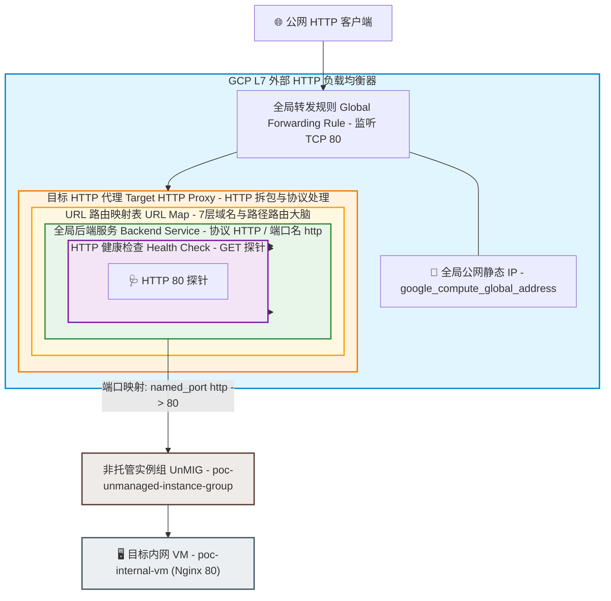

# GCP L7 外部应用负载均衡器 (L7 HTTP ALB) PoC 实验方案与实施指南

本文档记录基于 GCP (Google Cloud Platform) 搭建 **L7 外部应用负载均衡器 (External Application Load Balancer)** 的完整 PoC 实验方案。本次实验旨在验证通过 L7 LB 代理后端无公网 IP 虚拟机上的具体 HTTP 服务，深入理解 7 层代理的核心组件构成、`named_port` 映射机制以及配置落地流程。

---

## 1. 核心概念与工作原理厘清

在开启实验前，需明确 L7 负载均衡器在 GCP 中的底层定位与服务代理机制：

1. **代理目标**：L7 LB 的代理目标是**运行在虚拟机/容器 Socket (IP:Port) 上的具体 HTTP/HTTPS 服务进程**，而非“虚拟机操作系统实体”。
2. **端口映射与端口命名 (`named_port`)**：
   - 实例组 (UnMIG) 并不自动暴露所有端口。
   - 需要在 UnMIG 中显式定义 `named_port { name = "http", port = 80 }`，将符号名称 `http` 映射到具体的 TCP 端口 `80`。
   - 7 层 `Backend Service` 通过 `port_name = "http"` 找到目标端口并发起内部代理请求。
3. **反向代理模式 (Reverse Proxy)**：
   - 客户端与 L7 LB 完成 TCP/TLS 握手。
   - L7 LB 拆解 HTTP 标头并匹配 URL 路由规则 (URL Map)。
   - L7 LB 作为代理方，在 GCP 内部网络向后端服务的 `IP:Port` 发起全新的 HTTP 请求。

---

## 2. L7 LB 核心架构与 6 大组件依赖模型

不同于 L4 NLB 的 4 组件架构，GCP L7 HTTP 负载均衡器包含 **6 个物理/代码层面的核心组件**，形成了自外向内的层层嵌套与引用链：



### 组件依赖关系一览

| 顺序 | 组件名称 (Terraform Resource) | 核心职责与包含关系 |
| :---: | :--- | :--- |
| **1** | `google_compute_health_check` | 验证 HTTP 服务状态。配置 `http_health_check { port = 80, request_path = "/" }`。 |
| **2** | `google_compute_backend_service` | 流量分发大脑。指定 `protocol = "HTTP"`、`port_name = "http"`、关联 Health Check 和 UnMIG 实例组。 |
| **3** | `google_compute_url_map` | 7 层路由大脑。根据 Host / Path 将 HTTP 请求路由到指定的 Backend Service（默认路由送往 `backend_service`）。 |
| **4** | `google_compute_target_http_proxy` | 关联 URL Map，负责 HTTP 报文解包与卸载。 |
| **5** | `google_compute_global_address` | 预留全局静态 IPv4 地址。 |
| **6** | `google_compute_global_forwarding_rule` | **LB 入口实体**。绑定静态 IP，监听公网 80 端口，并将流量注入到 `target_http_proxy`。 |

---

## 3. 5 步走实验路线图 (Roadmap)

### 步骤一：后端 Web 服务全自动化部署
- **目标**：在纯内网 VM (`poc-internal-vm`) 启动时自动运行 Nginx Web 服务，监听 80 端口。
- **改动文件**：`tf-infra/gcevm.tf`
- **配置方式**：添加 `metadata_startup_script` 自动安装 Nginx 并写入测试页面 `index.html`。

脚本示例：
```bash
apt-get update && apt-get install -y nginx
echo "<h1>Hello from GCP L7 LB Backend - $(hostname)</h1>" > /var/www/html/index.html
systemctl restart nginx
```

### 步骤二：确认实例组端口映射配置
- **检查文件**：`tf-infra/unmig.tf`
- **确认配置**：确保 `google_compute_instance_group.poc_unmig` 中显式包含了 `named_port`。

HCL 配置：
```hcl
named_port {
  name = "http"
  port = "80"
}
```

### 步骤三：编写 L7 负载均衡器基础设施代码
- **目标文件**：`tf-infra/l7-lb.tf`
- **核心内容**：
  1. `google_compute_global_address.l7_lb_ip`
  2. `google_compute_health_check.l7_lb_hc` (HTTP 80)
  3. `google_compute_backend_service.l7_lb_backend` (Global, protocol HTTP)
  4. `google_compute_url_map.l7_lb_url_map`
  5. `google_compute_target_http_proxy.l7_lb_proxy`
  6. `google_compute_global_forwarding_rule.l7_lb_forwarding_rule`
  7. `google_compute_firewall.allow_http_lb` (允许 GCP 健康检查网段 `35.191.0.0/16`, `130.211.0.0/22` 访问 80 端口)

### 步骤四：通过 Git / CI/CD 自动部署与健康检测
- 提交代码推送至 `main` 分支，由 GitHub Actions 自动执行 `terraform apply`。
- 观察 GCP 后端服务健康状态命令：

```bash
gcloud compute backend-services get-health poc-l7-lb-backend-service --global
```

- 待健康状态由 `INITIAL` 转为 **`HEALTHY`**。

### 步骤五：7 层 HTTP 功能与 Header 连通性测试
- 获取全局 LB IP 命令：

```bash
gcloud compute addresses describe poc-l7-lb-ip --global --format="value(address)"
```

- 执行 HTTP 请求测试：

```bash
curl -i http://<L7_GLOBAL_IP>/
```

- 校验响应体是否包含 Nginx 网页内容，并观察响应头中的 Envoy 代理标头（如 `via: 1.1 google`）。

---

## 4. 验证与诊断命令清单

```bash
# 1. 查看全局 IP 资源
gcloud compute addresses list --global

# 2. 查看全局 Forwarding Rule 绑定关系
gcloud compute forwarding-rules describe poc-l7-lb-forwarding-rule --global

# 3. 查看 URL Map 路由表定义
gcloud compute url-maps describe poc-l7-lb-url-map

# 4. 检查全局 Backend Service 实时健康探针
gcloud compute backend-services get-health poc-l7-lb-backend-service --global
```
